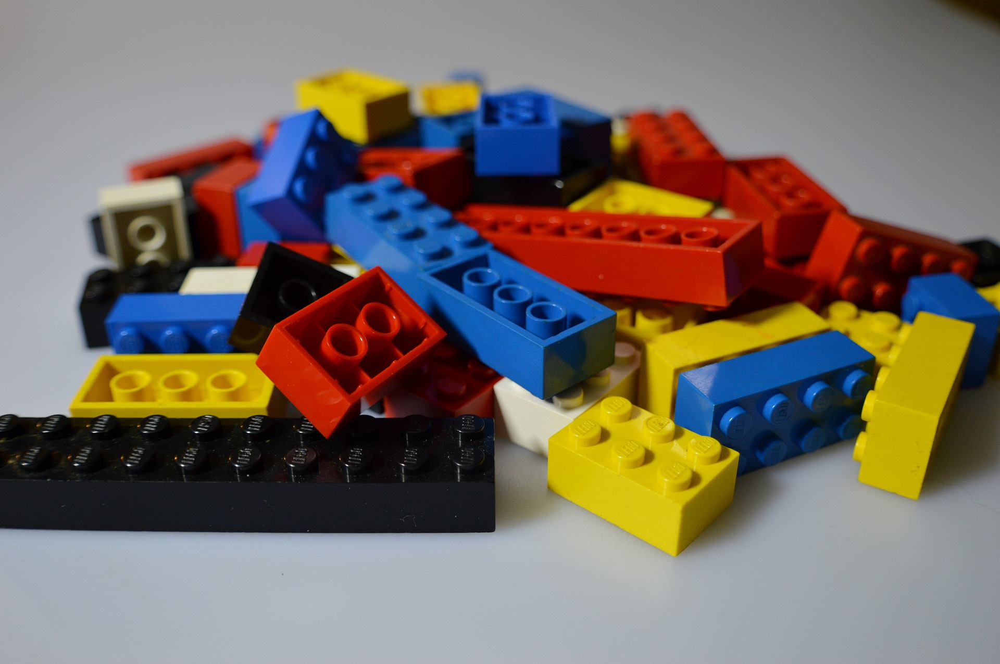
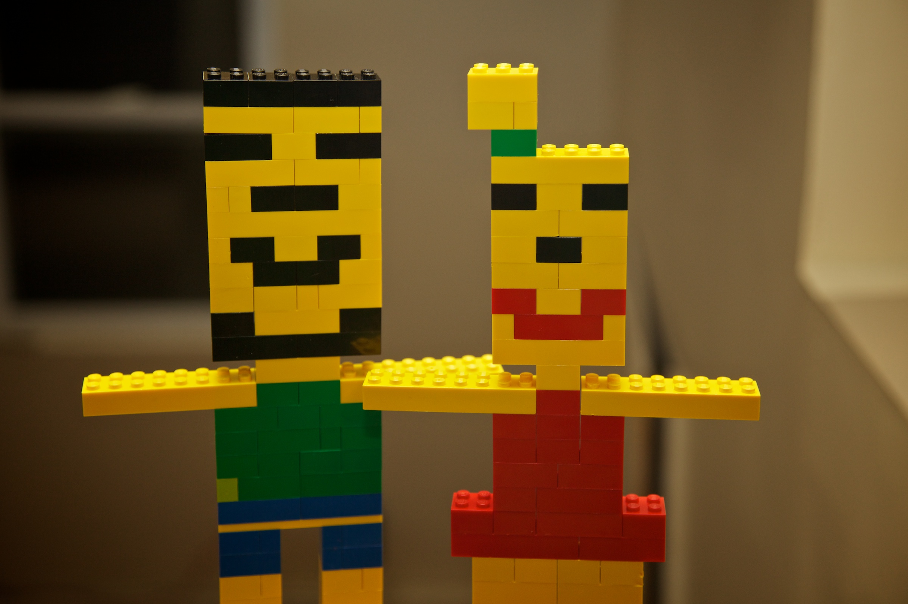
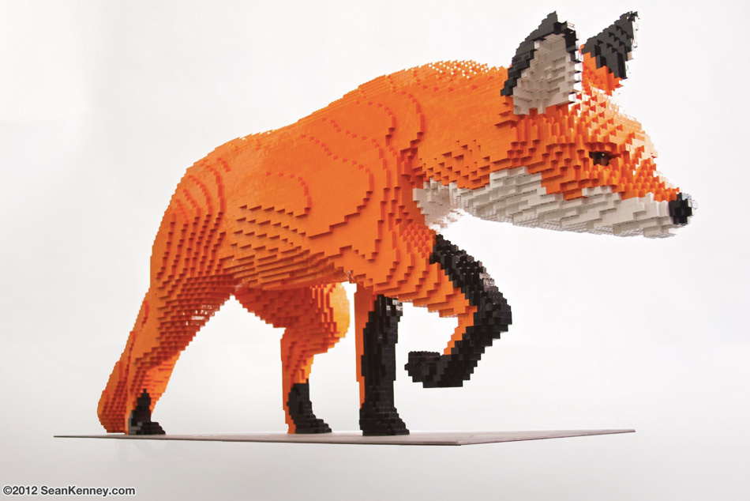
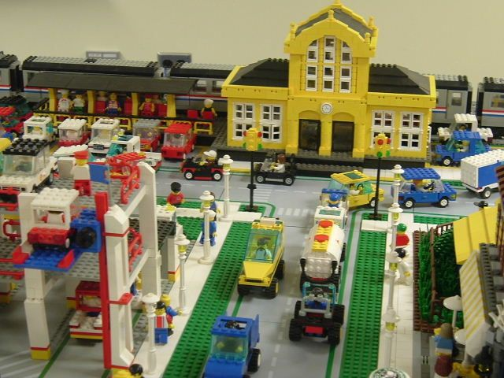

```{r setup, include=FALSE}
knitr::opts_chunk$set(echo = TRUE)
```

### Qui sommes-nous?

\alert{TODO: présentation rapide... dia plus "gaie" => photos à inclure}

- \alert{Biologistes marins} étudiant les coraux et le plancton

- \alert{Enseignants}, y compris biostatistiques et science des données

- \alert{Développeurs en R} (liste de packages)

- Observation des nos étudiants et collaborateurs apprenant et utilisant R => recherche de solutions pour les les aspects les plus délicats => Cette présentation détaillera quelques situations


### Des briques logicielles pour analyser ses données

L'analyse des données nécessite de fournir des **briques logicielles** que l'utilisateur peut assembler en fonction de ses besoins.



### Des briques logicielles pour analyser ses données

Un débutant devrait pouvoir en faire, par exemple, ceci :



### Des briques logicielles pour analyser ses données

Un expert fera ceci, même avec des briques simples au départ :



### Quel set de briques logicielles proposer?

Le set de briques de départ est déterminant. Par exemple, avec un set plus diversifié :




### L'écosystème R propose un (trop?) vaste choix

- 12.000+ packages sur CRAN, autant sur Bioconductor, R-forge, Github, Gitlab, etc. = _plusieurs "sets de briques" parfois incompatibles entre eux._
-  3 approches différentes (cf. Amélia McNamara) : **dollar** & **formule** (R base) _versus_ **Tidyverse**


### Courbe d'apprentissage de R


### Courbe d'apprentissage de R avec `Tidyverse`


### Courbe d'apprentissage idéale


---

\begin{center}
\Huge
\alert{Partie I : améliorer l'apprentissage des débutants (svData et svChart)}
\break
\break
\includegraphics[width=.3\linewidth]{figures/lego-R.png}
\end{center}


### Tidyverse enseigné aux débutants

La cohérence de `Tidyverse` aide à appréhender les différentes fonctions

Les débutants n'analysent pas directement la syntaxe. Ils retiennent des **patterns**.

Le nombre de patterns qu'ils pourront retenir est forcément limité au début. Donc, **homogénéiser, simplifier, réutiliser** autant que possible.


### SciViews::R

Install et chargement...

```{r comment=""}
#install.packages("SciViews")
SciViews::R
```


### Exemple : chargement de jeux de données {.fragile}

Les jeux de données exemples des packages sont accédés par :

```{r, eval=FALSE}
data(<name>)
```

La lecture de données sur le disque se fait à partir d'un pattern très différent :

```{r, eval=FALSE}
<name> <- read_csv("<file>")
```

. . .

#### Ces différences sont source de confusion

- Pas d'assignation pour `data()` => oubli pour `read_csv()`

. . .

- Guillemets pas nécessaires pour `<name>` dans `data()` => oubli de guillements pour d'autres chaines de caractères

. . .

- Et même : utilisation de `data("<file>")` pour tenter de charger des données depuis un fichier disque


### Solution

Le chargement de jeu de données est la première étape du débutant. _Elle doit se dérouler de manière ultra-fluide._

Le package `svData` propose un pattern unifié pour charger les données depuis un package R ou un fichier:

```{r, eval=FALSE}
<name> <- read("<dataset_or_file>"[, package = "<pkg>"][, <args>])
```

Si `package=` est spécifié, données du package, sinon, depuis le fichier. Reconnaissance des formats de fichiers et du contenu automatique pour les cas les plus simples (avec `readr`, `readxl`, `haven`, etc.)

#### Exemples

```{r, eval=FALSE}
SciViews::R  # Charge les packages principaux tidyverse + ...
cars <- read("mtcars", package = "datasets")
mydata <- read("~/data/file.csv")
```


### Patterns unifiés et simplifiés pour les graphiques (svChart) {.fragile}

Par exemple :

```{r}
urchin <- read("urchin_bio", package = "data", lang = "FR")
```

. . .

Labels et unités des variables disponibles :

```{r}
attributes(urchin$skeleton)
```

### Premier graphique avec `ggplot2` {.fragile}

\begincols
\begincol{.64\textwidth}

```{r fig.align="center", warning=FALSE}
ggplot(data = urchin, aes(weight, skeleton)) +
  geom_point()
```

\endcol
\begincol{.32\textwidth}

**Les premiers graphiques produits doivent être irréprochables.**

\vfill

- `ggplot2` = bon travail par défaut, _mais..._

. . .

- Libellés des axes par défaut sub-optimaux
- Unités manquantes
- Texte un peu petit
- Thème gris particulier

\endcol
\endcols


### Premier graphique, version `svChart`

\begincols
\begincol{.64\textwidth}

```{r fig.align="center", warning=FALSE}
chart(data = urchin, aes(weight, skeleton)) +
  geom_point()
```

\endcol
\begincol{.32\textwidth}

**Règle #1 : `chart()` remplace simplement `ggplot()`.**

\vfill

- Substitution facile à retenir
- Abondante documentation sur `ggplot2` réutilisable
- Libellés des axes et unités automatiques
- Thème "publication-ready"
- Fond transparent (intégration)

\endcol
\endcols


### Suite logique de l'analyse : régression linéaire

\begincols
\begincol{.64\textwidth}

```{r comment="", warning=FALSE}
(lmod <- lm(data = urchin, skeleton ~ weight))
```

\endcol
\begincol{.32\textwidth}

**Pattern non compatible avec celui du graphique.**

- `<x>, <y>` _versus_ `<y> ~ <x>`

- Approche Tidyverse _versus_ formula

- Inversion de la position des variables

_Comment simplifier vers un pattern unique?_

\endcol
\endcols


### Utilisation de formules avec `ggplot2`

\begincols
\begincol{.64\textwidth}

```{r fig.align="center", warning=FALSE}
ggplot(data = urchin, f_aes(skeleton ~ weight)) +
  geom_point()
```

\endcol
\begincol{.32\textwidth}

**Règle #2: formule `f_aes()` substitue `aes()`.**

\vfill

- Convergence vers un pattern unique

`<fun>(data = <df>, <formula>)`

\endcol
\endcols


### Utilisation de formules et de `chart()`

\begincols
\begincol{.64\textwidth}

```{r fig.align="center", warning=FALSE}
chart(data = urchin, skeleton ~ weight) +
  geom_point()
```

\endcol
\begincol{.32\textwidth}

**`f_aes()` est implicite!**

\vfill

- Convergence vers un pattern unique

`<fun>(data = <df>, <formula>)`

\endcol
\endcols


### Construction `chart$<fun>()`

\begincols
\begincol{.64\textwidth}

```{r fig.align="center", warning=FALSE}
chart$geom_point(data = urchin, skeleton ~ weight)
```

\endcol
\begincol{.32\textwidth}


\vfill

- Pattern unique !

`<fun>(data = <df>, <formula>)`

\endcol
\endcols


### `chart$<fun>()` compatible avec lattice et base plots

\begincols
\begincol{.64\textwidth}

```{r fig.align="center", warning=FALSE}
chart$xyplot(data = urchin, skeleton ~ weight)
```

\endcol
\begincol{.32\textwidth}

\vfill

- Pattern unique !

`<fun>(data = <df>, <formula>)`

- Thèmes `ggplot2` / `lattice` homogènes

- Prise en compte des labels encore à faire


\endcol
\endcols


---

Arguments supplémentaires `aes` intégrables à la formule avec `%<par>=%` :

```{r fig.align="center", warning=FALSE}
#chart$geom_point(data = urchin, skeleton ~ weight, col = origin)
chart$geom_point(data = urchin, skeleton ~ weight %col=% origin)
```

---

Facets intégrables dans la formule avec `|` (= `lattice`) :

```{r fig.align="center", warning=FALSE}
#chart$geom_point(data = urchin, skeleton ~ weight) +
#  facet_wrap(~origin)
chart$geom_point(data = urchin, skeleton ~ weight | origin)
```

---

Ajout de la droite de régression :

```{r fig.align="center", warning=FALSE}
chart$geom_point(data = urchin, skeleton ~ weight) +
  geom_smooth(method = "lm")
```


### Compatibilité `chart` pour base/lattice/ggplot2

\begincols
\begincol{.64\textwidth}

```{r fig.align="center", warning=FALSE}
par(mfrow = c(2L, 2L))
plot(lmod, which = 1L)
plot(lmod, which = 2L)
# Comment ajouter???
#chart$geom_point(data = urchin, skeleton ~ weight) +
#  geom_smooth(method = "lm")
```

\endcol
\begincol{.32\textwidth}

Analyse des résidus de `lm()` => graphiques de base

\vfill

_Surprise ! Incompatibilité avec `ggplot2`_

\endcol
\endcols


### Compatibilité `chart` pour base/lattice/ggplot2

```{r eval=FALSE}
charts <- list(
  # ggplot2
  chart$geom_point(data = urchin, skeleton ~ weight) +
    geom_smooth(method = "lm"),
  # Lattice plot
  chart$xyplot(data = urchin, skeleton ~ weight | origin),
  # Base plot
  chart$plot(lmod, which = 1L),
  chart$plot(lmod, which = 2L)
)
combine_charts(charts)
```

### Compatibilité `chart` pour base/lattice/ggplot2

```{r warning=FALSE, include=FALSE}
# Base plots
c1 <- chart$plot(lmod, which = 1L,
  pch = 16, las = 1, cex.axis = 0.8)
#c2 <- chart$plot(lmod, which = 2L,
#  pch = 16, las = 1, cex.axis = 0.8)
c2 <- chart$base(function() {plot(lmod, which = 2L, las = 1, cex.axis = 0.8);rect(par("usr")[1], par("usr")[3], par("usr")[2], par("usr")[4], col = "white"); grid(lty = "solid"); par(new = TRUE); plot(lmod, which = 2L, las = 1, cex.axis = 0.8, add = TRUE, bg = "gray")})
# ggplot2
c3 <- chart$geom_point(data = urchin, skeleton ~ weight) +
  geom_smooth(method = "lm") +
  theme(plot.margin = margin(0.8, 0.5, 0.3, 0.8, "cm"))
# Lattice plot
c4 <- chart$xyplot(data = urchin, skeleton ~ weight | origin,
  pch = 16, col = "black", xlab = "Masse totale [g]", ylab = "Masse du squelette [g]", scales = list(alternating = 1))
```

```{r warning=FALSE, fig.align="center", fig.width = 8, fig.height = 4.5}
ggarrange(c3, c4, c1, c2, labels = "AUTO")
```


---

\begin{center}
\Huge
\alert{Partie II : faciliter la transition vers l'écriture de fonctions (svFlow)}
\break
\break
\includegraphics[width=.3\linewidth]{figures/lego-rocket.png}
\end{center}


### Pipeline dans Tidyverse _versus_ package `flow` (`SciViews::R`) {.fragile}

\begincols
\begincol{.48\textwidth}

**Tidyverse**

```{r eval=FALSE}
urchin %>%
  mutate(lgsk = log(skeleton)) %>%
  summarise(mean = mean(lgsk,
    na.rm = TRUE))
```

\endcol

. . . 

\begincol{.48\textwidth}

**SciViews::R**

```{r eval=FALSE}
urchin %>_%
  mutate(., lgsk = log(skeleton)) %>_%
  summarise(., mean = mean(lgsk,
    na.rm = TRUE)) %>_% .
```

\endcol
\endcols

#### Création d'un objet `flow` à l'aide de `%>_%`

- L'objet contient toutes les variables liées au fonctionnement du pipeline

. . .

- Position explicite de l'argument du pipe (`.`) => moins d'ambiguités!

. . . 

- `%>_% .` à la fin extrait la valeur finale de l'objet `flow`


### Création explicite de l'objet `flow` : permet d'inclure d'autres variables {.fragile}

\begincols
\begincol{.48\textwidth}

**Tidyverse**

```{r eval=FALSE}
#
na_rm <- TRUE
urchin %>%
  mutate(lgsk = log(skeleton)) %>%
  summarise(mean = mean(lgsk,
    na.rm = !!na_rm))
```

\endcol

. . .

\begincol{.48\textwidth}

**SciViews::R**

```{r eval=FALSE}
flow(urchin,
  na_rm = TRUE
) %>_%
  mutate(., lgsk = log(skeleton)) %>_%
  summarise(., mean = mean(lgsk,
    na.rm = na_rm_)) %>_% .
```

\endcol
\endcols

#### La variable `na_rm` est incluse dans l'objet `flow`

- Elle ne **pollue pas l'environnement** où le pipeline est exécuté, contrairement à ce qui se passe à gauche

- Opérateur préfixé `!!` (lazyeval) de **Tidyverse** remplacé par l'opérateur `_` sufixé dans flow (mécanisme "lazyeval")


### Utilisation plus naturelle des `quosure`s dans `flow` {.fragile}

\begincols
\begincol{.48\textwidth}

**Tidyverse**

```{r eval=FALSE}
#
x <- quo(skeleton)
na_rm <- TRUE
urchin %>%
  mutate(lgsk = log(!!x)) %>%
  summarise(mean = mean(lgsk,
    na.rm = !!na_rm))
```

\endcol

. . .

\begincol{.48\textwidth}

**SciViews::R**

```{r eval=FALSE}
flow(urchin,
  x_ = skeleton,
  na_rm = TRUE
) %>_%
  mutate(., lgsk = log(x_)) %>_%
  summarise(., mean = mean(lgsk,
    na.rm = na_rm_)) %>_% .
```

\endcol
\endcols

#### Une variable `flow` suffixée de `_` crée **automatiquement** une `quosure`

- Le passage d'expressions via les `quosure`s devient parfaitement naturelle et totalement transparent avec l'opérateur sufixé `_`

- la spécification de l'expression est largement simplifiée (pas besoin de `quo()` ou `enquo()`, objectif premier de l'utilisation de la NSE!)


### Version finale avec trois variables {.fragile}

\begincols
\begincol{.48\textwidth}

**Tidyverse**

```{r eval=FALSE}
#
x <- quo(skeleton)
y <- "lgsk"
y_quo <- as.quosure(as.name(y))
na_rm <- TRUE
urchin %>%
  mutate(!!y := log(!!x)) %>%
  summarise(mean = mean(!!y_quo,
    na.rm = !!na_rm))
```

\endcol

. . .

\begincol{.48\textwidth}

**SciViews::R**

```{r eval=FALSE}
flow(urchin,
  x_ = skeleton,
  y_ = lgsk,
  
  na_rm = TRUE
) %>_%
  mutate(., y_ = log(x_)) %>_%
  summarise(., mean = mean(y_,
    na.rm = na_rm_)) %>_% .
```

\endcol
\endcols

#### La définition d'un nom de variable et son utilisation ensuite dans un pipeline est beaucoup plus simple que dans `Tidyverse`

- Une seule variable au lieu de deux (`y` (`character`) et `y_quo` (`quosure`))!

- Pas d'obligation de remplacer `=` par `:=` pour conserver une syntaxe R correcte


### Fonction réutilisable depuis un pipeline ("séquence fonctionnelle") {.fragile}

\alert{Travail en cours...}

\begincols
\begincol{.48\textwidth}

**Tidyverse**

```{r eval=FALSE}
#
x <- quo(skeleton)
y <- "lgsk"
y_quo <- as.quosure(as.name(y))
na_rm <- TRUE
foo <- . %>%
  mutate(!!y := log(!!x)) %>%
  summarise(mean = mean(!!y_quo,
    na.rm = !!na_rm))
# Utilisation
foo(urchin)
```

\endcol

. . .

\begincol{.48\textwidth}

**SciViews::R**

```{r eval=FALSE}
foo <- flow_function(urchin,
  x_ = skeleton,
  y_ = lgsk,
  
  na_rm = TRUE
) %>_%
  mutate(., y_ = log(x_)) %>_%
  summarise(., mean = mean(y_,
    na.rm = na_rm_)) %>_% .
# Utilisation, autre variable
foo(urchin, x_ = weight)
```

\endcol
\endcols

#### Seul `flow` permet d'inclure d'autres variables dans la séquence fonctionnelle `foo`

- `flow()` est juste remplacé par `flow_function()`

. . .

- Passage à une fonction véritable **beaucoup plus facile et intuitive** à partir de `flow_function()` (conversion automatisée même possible)!


----

Dia avec les remerciements, etc.
